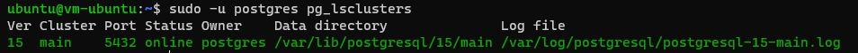
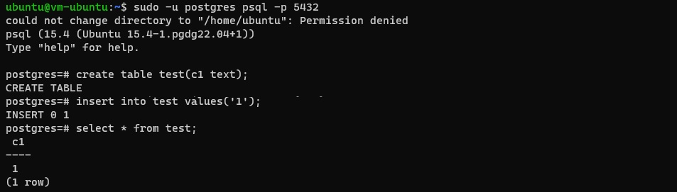
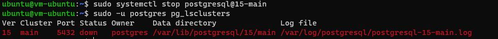
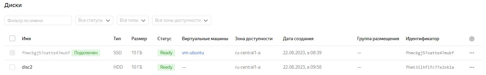

# Домашнее задание №3

Описание/Пошаговая инструкция выполнения домашнего задания:
* создайте виртуальную машину c Ubuntu 20.04/22.04 LTS в GCE/ЯО/Virtual Box/докере
* поставьте на нее PostgreSQL 15 через sudo apt
* проверьте что кластер запущен через sudo -u postgres pg_lsclusters
  > скрин: 
* зайдите из под пользователя postgres в psql и сделайте произвольную таблицу с произвольным содержимым
  > скрин: 
* остановите postgres (например, через sudo -u postgres pg_ctlcluster 15 main stop)
  > скрин: 
* создайте новый диск к ВМ размером 10GB
  > скрин: 
* добавьте свеже-созданный диск к виртуальной машине - надо зайти в режим ее редактирования и дальше выбрать пункт attach existing disk
sudo lsblk -o NAME,FSTYPE,SIZE,MOUNTPOINT,LABEL
* проинициализируйте диск согласно инструкции и подмонтировать файловую систему, только не забывайте менять имя диска на актуальное, в вашем случае это скорее всего будет /dev/sdb - https://www.digitalocean.com/community/tutorials/how-to-partition-and-format-storage-devices-in-linux
sudo parted -l | grep Error
sudo parted /dev/vdb mklabel gpt
mkpart primary ext4 0% 100%
sudo mkfs -t ext4 /dev/vdb1
sudo mkdir -p /mt/vdb1
sudo mount -t auto /dev/vdb1 /mt/vdb1
* перезагрузите инстанс и убедитесь, что диск остается примонтированным (если не так смотрим в сторону fstab)
/dev/vdb1 /mnt/vdb1 ext4 defaults 0 0  --добавить в файл /etc/fstab
yc compute instance restart vm-ubuntu
* сделайте пользователя postgres владельцем /mnt/data - chown -R postgres:postgres /mnt/data/
sudo chown -R postgres:postgres /mnt/vdb1/
* перенесите содержимое /var/lib/postgres/15 в /mnt/data - mv /var/lib/postgresql/ 15/mnt/data
sudo mv /var/lib/postgresql/15 /mnt/vdb1
* попытайтесь запустить кластер - sudo -u postgres pg_ctlcluster 15 main start
sudo -u postgres pg_ctlcluster 15 main start
* напишите получилось или нет и почему
Запустить кластер не получилось, так как необходимые для запуска файлы были перемещены в другую директорию.
* задание: найти конфигурационный параметр в файлах расположенных в /etc/postgresql/15/main который надо поменять и поменяйте его
cd /etc/postgresql/15/main/
sudo cat /etc/postgresql/15/main/postgresql.conf
* напишите что и почему поменяли
В файле postgresql.conf  поменял директорию для параметра: data_directory = '/mnt/vdb1/15/main/'. 
Сделал это потому, что ранее файлы, необходимые для запуска кластера располагались в другой директории, а в п.11 эти файлы были перемещены.
* попытайтесь запустить кластер - sudo -u postgres pg_ctlcluster 15 main start
* напишите получилось или нет и почему
Не получилось запустить кластер.  Потому что после обновления файла postgresql.conf нужно перезапустить  виртуальную машину.
* зайдите через psql и проверьте содержимое ранее созданной таблицы
sudo su postgres
psql
select * from test;

