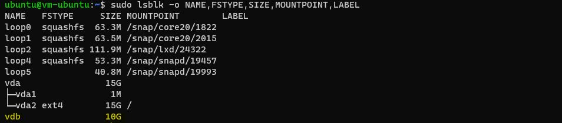
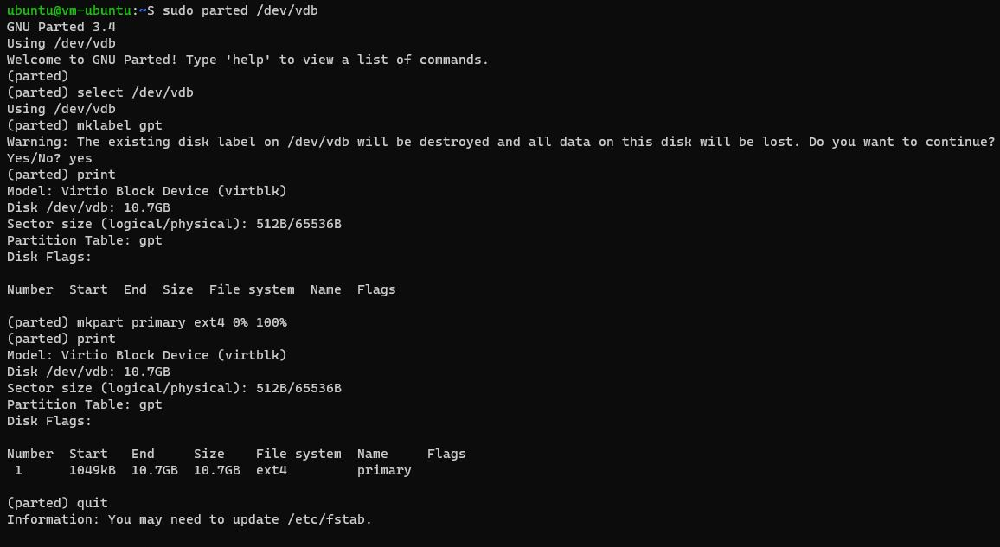
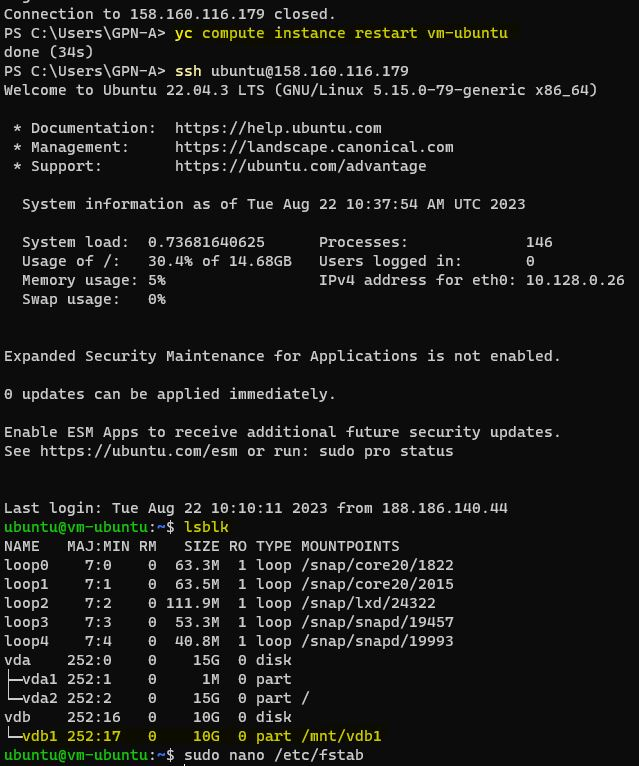
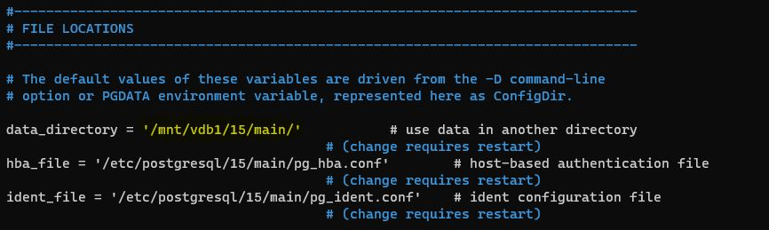
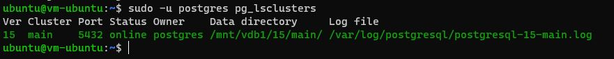

# Домашнее задание №3

Описание/Пошаговая инструкция выполнения домашнего задания:
* Создайте виртуальную машину c Ubuntu 20.04/22.04 LTS в GCE/ЯО/Virtual Box/докере
* Поставьте на нее PostgreSQL 15 через sudo apt
* Проверьте что кластер запущен через sudo -u postgres pg_lsclusters
  > скрин: 
* Зайдите из под пользователя postgres в psql и сделайте произвольную таблицу с произвольным содержимым
  > скрин: 
* Остановите postgres (например, через sudo -u postgres pg_ctlcluster 15 main stop)
  > скрин: 
* Создайте новый диск к ВМ размером 10GB
  > скрин: 
* Добавьте свеже-созданный диск к виртуальной машине - надо зайти в режим ее редактирования и дальше выбрать пункт attach existing disk
  > скрин: 
  > скрин: 
* 8Проинициализируйте диск согласно инструкции и подмонтировать файловую систему, только не забывайте менять имя диска на актуальное, в вашем случае это скорее всего будет /dev/sdb - https://www.digitalocean.com/community/tutorials/how-to-partition-and-format-storage-devices-in-linux
sudo parted -l | grep Error
sudo parted /dev/vdb mklabel gpt
mkpart primary ext4 0% 100%
sudo mkfs -t ext4 /dev/vdb1
sudo mkdir -p /mt/vdb1
sudo mount -t auto /dev/vdb1 /mt/vdb1
  > Открыл диск хранения, который собираюсь разделить. Затем указываю явно имя диска для разбиения. Создаю таблицу разделов gpt. Cкрин: 
  > Указываю явно имя диска для разбиения: 
  > скрин: 
* Перезагрузите инстанс и убедитесь, что диск остается примонтированным (если не так смотрим в сторону fstab).
 __*В файле /etc/fstab добавил строчку "/dev/vdb1 /mnt/vdb1 ext4 defaults 0 0"  для автоматического монтирования диска после перезапуска инстанса.*__
  > скрин: 
* Cделайте пользователя postgres владельцем /mnt/data - sudo chown -R postgres:postgres /mnt/vdb1/
* Перенесите содержимое /var/lib/postgres/15 в /mnt/data - sudo mv /var/lib/postgresql/15 /mnt/vdb1
  > скрин: 
* Попытайтесь запустить кластер - sudo -u postgres pg_ctlcluster 15 main start
  > скрин: 
* Напишите получилось или нет и почему
 __*Запустить кластер не получилось, так как необходимые для запуска файлы были перемещены в другую директорию.*__
* Задание: найти конфигурационный параметр в файлах расположенных в /etc/postgresql/15/main который надо поменять и поменяйте его
 __*Файл называется postgresql.conf*__
  > скрин: 
* Напишите что и почему поменяли
 __*В файле postgresql.conf  поменял директорию для параметра: data_directory = '/mnt/vdb1/15/main/'.*__
 __*Сделал это потому, что ранее файлы, которые необходимы для запуска кластера располагались в другой директории, а в п.11 эти файлы были перемещены.*__
* Попытайтесь запустить кластер - sudo -u postgres pg_ctlcluster 15 main start
  > скрин: 
* Напишите получилось или нет и почему
 __*Не получилось запустить кластер.  Потому что после обновления файла postgresql.conf нужно перезапустить виртуальную машину. После перезапуска ВМ - запустился.*__
  > скрин: 
* Зайдите через psql и проверьте содержимое ранее созданной таблицы
 __*Вставленные мною данные в таблицу присутствуют.*__
  > скрин: 

