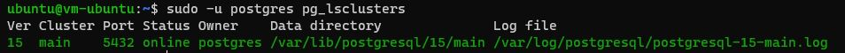
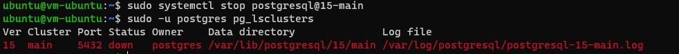

# Домашнее задание №3 (Тема "Физический уровень PostgreSQL")
 
Описание/Пошаговая инструкция выполнения домашнего задания:
* Создайте виртуальную машину c Ubuntu 20.04/22.04 LTS в GCE/ЯО/Virtual Box/докере
* Поставьте на нее PostgreSQL 15 через sudo apt
* Проверьте что кластер запущен через sudo -u postgres pg_lsclusters
  > 
* Зайдите из под пользователя postgres в psql и сделайте произвольную таблицу с произвольным содержимым
  > 
* Остановите postgres (например, через sudo -u postgres pg_ctlcluster 15 main stop)
  > 
* Создайте новый диск к ВМ размером 10GB
  > 
* Добавьте свеже-созданный диск к виртуальной машине - надо зайти в режим ее редактирования и дальше выбрать пункт attach existing disk
  > 
  > 
* Проинициализируйте диск согласно инструкции и подмонтировать файловую систему, только не забывайте менять имя диска на актуальное, в вашем случае это скорее всего будет /dev/sdb -  https://www.digitalocean.com/community/tutorials/how-to-partition-and-format-storage-devices-in-linux
  __*Выделяю новый диск, который собираюсь разделить. Задаю тип таблицы разделов GPT. Print'ом просматриваю таблицу разделов.*__
  \
  __*Вывожу список устройств хранения и разделов. Убеждаюсь, что новый раздел выделен.*__
  \
  __*Форматирую раздел Ext4, затем создаю директорию монтирования, после этого выполняю процесс монтирования*__
  \
* Перезагрузите инстанс и убедитесь, что диск остается примонтированным (если не так смотрим в сторону fstab).
  __*В файле /etc/fstab добавил строчку "/dev/vdb1 /mnt/vdb1 ext4 defaults 0 0"  для автоматического монтирования диска после перезапуска инстанса.*__
  > 
* Cделайте пользователя postgres владельцем /mnt/data - sudo chown -R postgres:postgres /mnt/vdb1/
* Перенесите содержимое /var/lib/postgres/15 в /mnt/data - sudo mv /var/lib/postgresql/15 /mnt/vdb1
  > 
* Попытайтесь запустить кластер - sudo -u postgres pg_ctlcluster 15 main start
  > 
* Напишите получилось или нет и почему
  __*Запустить кластер не получилось, так как необходимые для запуска файлы были перемещены в другую директорию.*__
* Задание: найти конфигурационный параметр в файлах расположенных в /etc/postgresql/15/main который надо поменять и поменяйте его
  __*Файл называется postgresql.conf*__
  > 
* Напишите что и почему поменяли
  __*В файле postgresql.conf  поменял директорию для параметра: data_directory = '/mnt/vdb1/15/main/'.*__
  __*Сделал это потому, что ранее файлы, которые необходимы для запуска кластера располагались в другой директории, а в п.11 эти файлы были перемещены.*__
* Попытайтесь запустить кластер - sudo -u postgres pg_ctlcluster 15 main start
  > 
* Напишите получилось или нет и почему
  __*Не получилось запустить кластер.  Потому что после обновления файла postgresql.conf нужно перезапустить виртуальную машину. После перезапуска ВМ - запустился.*__
  > 
* Зайдите через psql и проверьте содержимое ранее созданной таблицы
  __*Вставленные мною данные в таблицу присутствуют.*__
  > 

